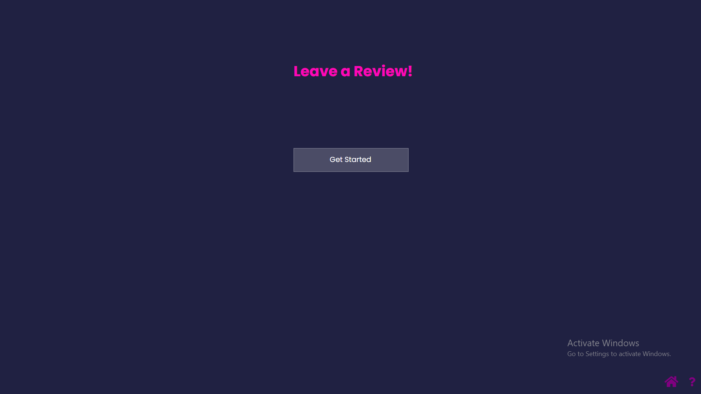
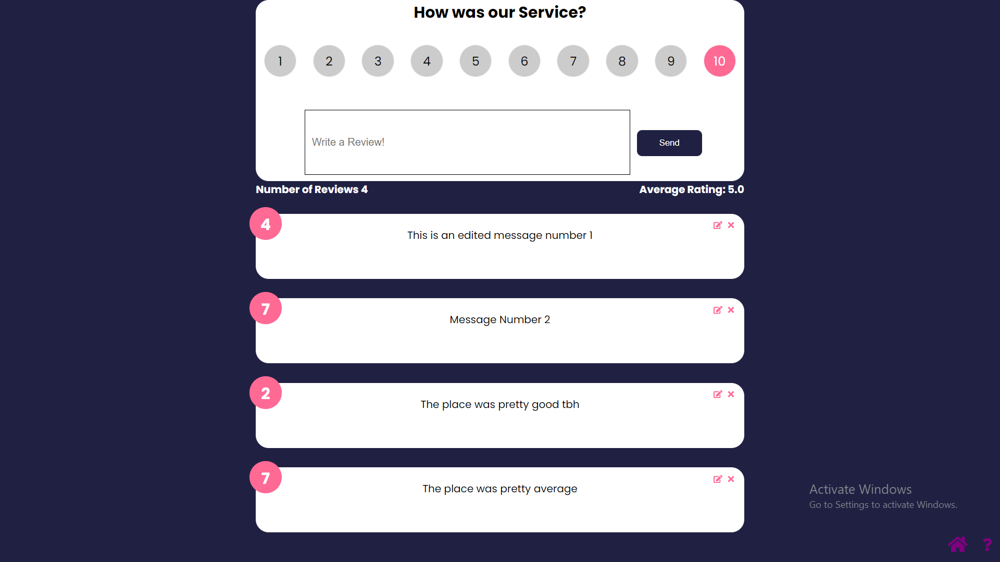
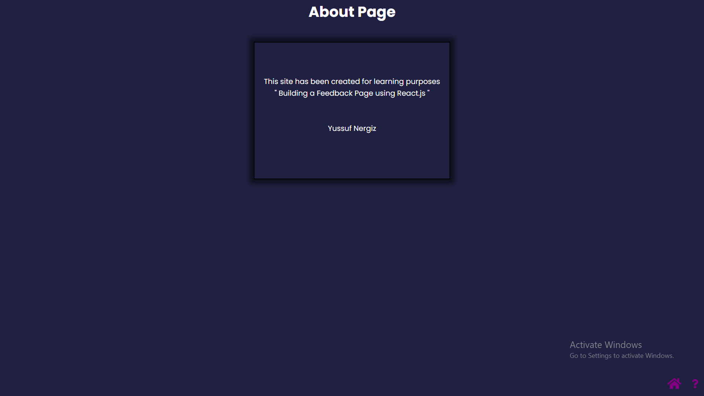

Simple React Feedback-Application

The app has been built using React.js for FrontEnd and JSON server in the backend.

All of the used Technologies:
          ||||
          ||||
          vvvv
Postman -- for managing the backend data.
Netlify -- to deploy the website.
React.js -- for front-end.
JSON Server -- back-end.
Font Awesome -- for icons.
HTML, CSS -- for design.
-------------------------------
The Application also includes some of the important React concepts such as: Routes and Context.
-------------------------------

-------------------------------

-------------------------------

https://user-images.githubusercontent.com/80420105/179276803-e1fb1b64-f442-4090-a3ee-00842a817e34.mp4

